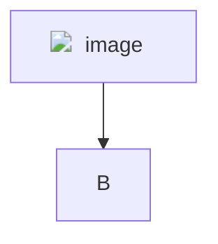
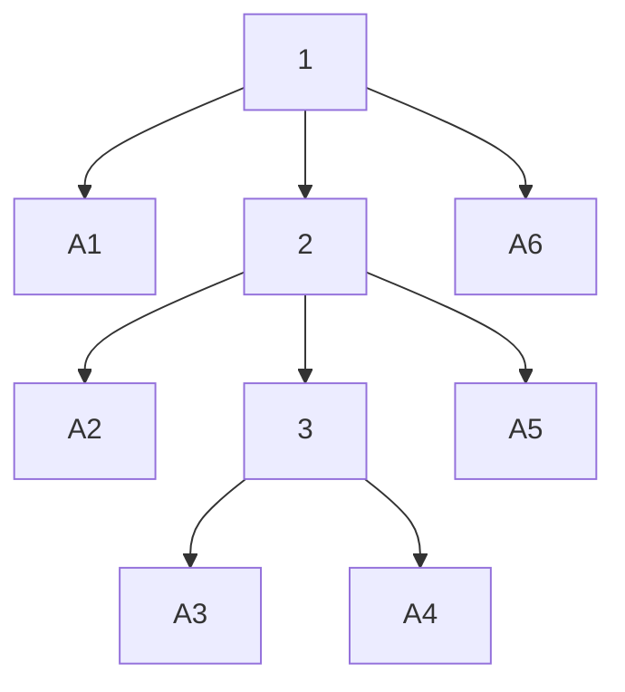

Diagramming quire relations with mermaid?

h = ""

## Ternion

graph TD
    style A fill:#ffffff,stroke:#000000,stroke-width:2
    style B fill:#ffffff,stroke:#000000,stroke-width:2
    style C fill:#ffffff,stroke:#000000,stroke-width:2
    
    A(( )) --> B(( ))
    B(( )) --> C(( ))