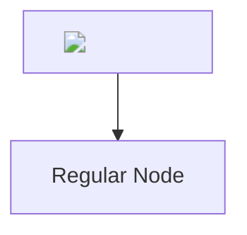
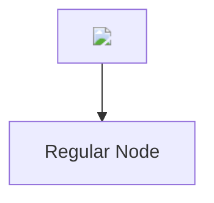

## Suarez

Here’s how you can construct a Markdown diagram (using Mermaid syntax) with two nodes, where the first node displays an image:

STATIC:

FIF:

IIIF:

### Explanation:
1. **Node A**:
   - Contains an embedded image using Markdown syntax: ``.
   - The `Alt text` can be replaced with any descriptive text (e.g., "Voynich Manuscript").
   - The `URL` is the image source: `https://manuscriptroadtrip.wordpress.com/wp-content/uploads/2015/01/voynich-detail.jpg`.

2. **Node B**:
   - A regular text node.

3. **Arrow (A --> B)**:
   - Creates a connection from Node A to Node B.

### Notes:
- You can use this code in environments that support Mermaid diagrams, such as online editors like [Mermaid Live Editor](https://mermaid-js.github.io/mermaid-live-editor/) or platforms like GitHub that support Mermaid rendering.
- Ensure the environment supports Markdown syntax for image rendering within nodes.

If the Markdown rendering for images is not supported in your Mermaid tool, let me know, and I can suggest an alternative!